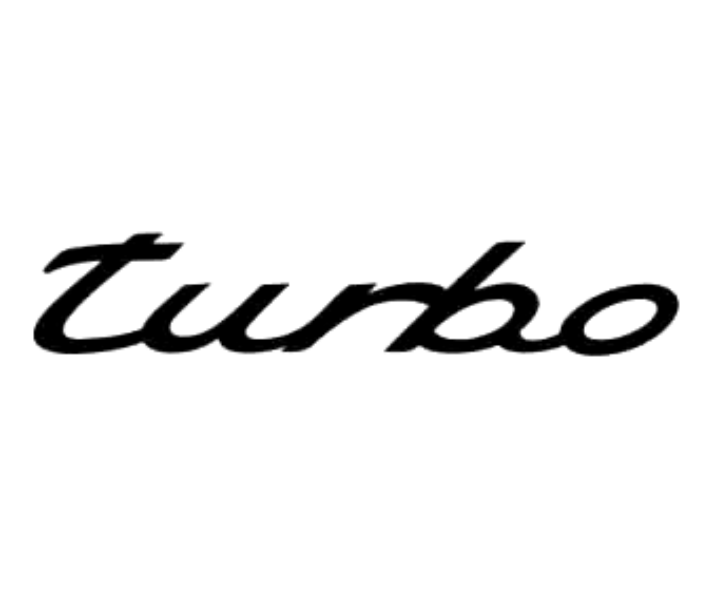

.. Copyright 2023 The Elastic AI Search Authors.
.. Licensed under the Apache License, Version 2.0 (the "License");

Turbo is a library of c++17 components designed with practicality
and efficiently in mind. However, it seems like stl, but it just
augments to stl. Turbo is the foundation of gottingen ai inf.

Contents
--------

.. toctree::
    :caption: GET START

    en/overview
    en/platform

.. toctree::

    en/install

.. toctree::
    :maxdepth: 3
    :caption: TUTORIAL

    en/testing
    en/tutorial

.. toctree::
    :maxdepth: 3
    :caption: API REFERENCE

    en/api/base
    en/api/files
    en/api/hash
    en/api/memory
    en/api/platform
    en/api/random
    en/api/strings
    en/api/simd
    en/api/unicode

.. toctree::
    :caption: 中文文档

    cn/overview

.. toctree::

    cn/install

