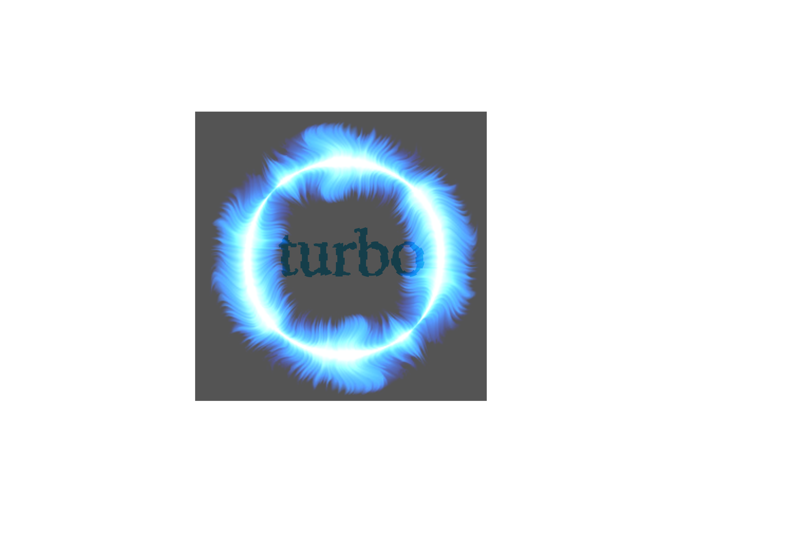

Turbo
==========

Turbo is a library of c++17 components designed with practicality
and efficiently in mind. However, it seems like stl, but it just
augments to stl. Turbo is the foundation of gottingen ai inf.

Contents
--------

.. toctree::
    :caption: ENGLISH

    en/overview
    en/platform

.. toctree::

    en/install

.. toctree::
    :caption: API REFERENCE

    en/api/platform
    en/api/base

.. toctree::
    :caption: 中文文档

    cn/overview

.. toctree::

    cn/install

